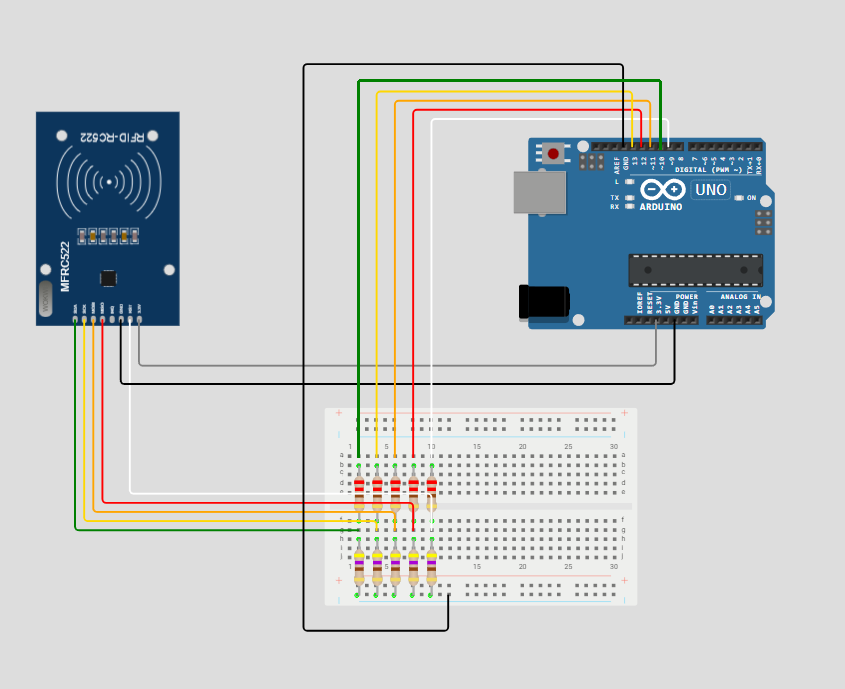
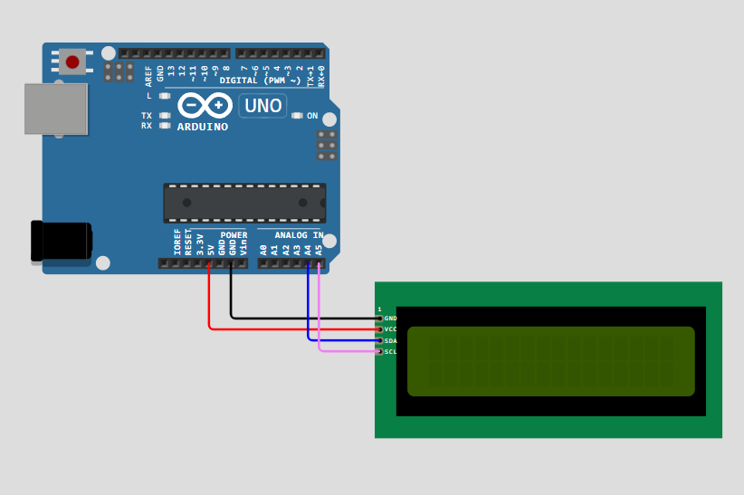

# Trabajo Práctico Final Arduino
Proyecto Transversal C3 – Facultad de Ingeniería UNMDP

## Sistema de Control de Acceso

### Objetivo

Crear un Sistema de Control de Acceso mediante lectura de tarjetas por aproximación (RFID). El mismo deberá indicar al usuario si está autorizado, si su tarjeta es válida o no, en una pantalla LCD. A su vez, el acceso autorizado deberá indicarse por leds en formato semáforo (VERDE: puede pasar, ROJO: tarjeta inválida, AMARILLO: otras alertas). Se anunciará con una señal sonora los actos de lectura o rechazo.

### Componentes

- Placa Arduino UNO.
- Módulo Led RGB HW479.
- Resistencias de 220 y 470 Ohms.
- Pantalla LCD 16x2 con módulo de comunicación I2C integrado.
- Sensor lector de tarjetas RFID-RC522.
- Tarjetas y llaveros de prueba.
- Buzzer piezoeléctrico.

### Tareas a Resolver

Para poder resolver el problema general, es necesario separar en partes el mismo, para ir avanzando en etapas y compartimentar las funciones principales en “módulos” (aunque el código lo verá dentro de el segmento loop, para no perder tiempo en llamadas a funciones):

- **Lectura de Tarjetas**: Primero, se debe lograr leer una tarjeta y obtener la información en el monitor serie.
- **Visado de Tarjetas**: Comparar los datos obtenidos del lector RFID-RC522 con las tarjetas guardadas en un arreglo de cadenas de texto que contienen las tarjetas empadronadas.
- **Procesamiento de datos**: Programar la lógica de aceptación/rechazo/alertas en función de la información obtenida del lector RFID-RC522. Desarrollar el manejo de los pines que controlan los dispositivos de salida visuales y sonoros (por ej., buzzer piezoeléctrico).
- **Muestra de datos e información visual**: Programar la salida de datos en pantalla LCD e información visual de LECTURA/INGRESO/RECHAZO a través del semáforo led (módulo o leds separados).

#### Lectura de Tarjetas por RFID

Para la lectura de las tarjetas por aproximación, usamos el módulo RC522. El mismo trabaja a 3.3V, por lo que es necesario un conversor lógico de 5V a 3.3V (ST1167). Como no lo tenemos, la alternativa más próxima es armar un divisor de tensión sobre las cinco líneas de comunicación que pueden verse afectadas con un voltaje alto (SDA, SCK, MOSI, MISO y RST). Dicho divisor de tensión se armó con resistencias de 220Ω y 470Ω.

A continuación se puede ver el circuito que recibe la información por RFID de las tarjetas:

  
El lector obtiene los datos en forma de números hexadecimales. El acto de lectura se mostrará al usuario con la confirmación visual de un LED AZUL.

| RC522 | Arduino UNO |
| :---: | :---------: |
| GND | GND |
| VCC | 3.3V |
| SDA | 10 |
| SCK | 13 |
| MOSI | 11 |
| MISO | 12 |
| RST | 9 |

Para este sensor se utilizó la librería [MFRC522 del usuario de Github miguelbalboa](https://github.com/miguelbalboa/rfid).

#### Procesamiento de Datos

En esta parte no hay mucha comunicación con sensores, sino con los datos recibidos y los strings de tarjetas admitidas, ya guardados en variables. En esta parte del sketch se prepara la información que se enviará al cliente web y a la pantalla LCD. A saber:

1. En función del número de tarjeta, determinar si es válida. Si lo anterior se cumple, determinar si el agente tiene acceso o no.
2. Preparar los mensajes que saldrán hacia la pantalla LCD, detallando nro de tarjeta y resultado (“AUTORIZADO”, “SIN ACCESO”, “SIN LECTURA”).
3. En función del resultado activar led usado previamente para lectura, con tonos de semáforo, para que tengan coherencia con los estados presentados en el LCD.

#### Muestra de Datos e Información Visual

Luego de obtener los datos del sensor RC522, procesar la información y verificar el acceso del personal y la validez de la lectura. Es necesario comunicar al usuario en forma resumida el resultado del registro. Esto lo hacemos con la ayuda de un display 16x2 (dos renglones de dieciséis caracteres, mediante el protocolo I2C) y el módulo led RGB.

| LCD 1602 | Arduino UNO |
| :------: | :---------: |
| GND | GND |
| VCC |	5V |
| SDA |	A4 |
| SCL |	A5 |

Para poder operar la pantalla se utilizó la librería [LiquidCrystal_I2C](https://github.com/markub3327/LiquidCrystal_I2C).

| Módulo RGB | Arduino UNO |
| :--------: | :---------: |
| GND | GND |
| ROJO | 4 |
| VERDE | 3 |
| AZUL | 2 |
